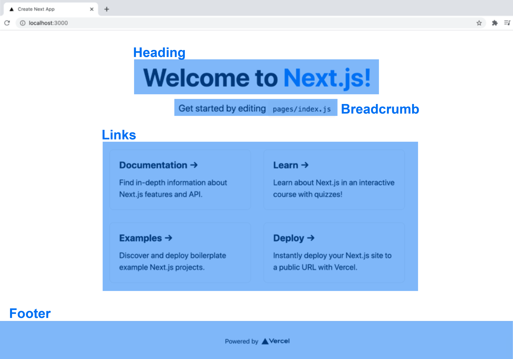

# はじめての React

これは**はじめて React に触れる方のためのチュートリアル**です。

---

Step1：Next.js が用意するコマンドでテンプレートを作成。

Step2：ローカルサーバーで立ち上げる。

Step3：初期画面をコンポーネント化しリファクタリングする。

---

## Step 1

Next.js の公式サイトにアクセスし、ドキュメントの [Getting Started](https://nextjs.org/docs/getting-started) にある以下のコマンドをターミナルで入力する。

```bash
npx create-next-app@latest
# or
yarn create next-app
```

その後下記のように、対話形式でプロジェクト名が質問されるため、任意のプロジェクト名を入力する。（※下記の例では「my-app」）

```bash
 % npx create-next-app@latest
Need to install the following packages:
  create-next-app
Ok to proceed? (y) y
✔ What is your project named? … my-app
```

インストールが成功すると下記の文章が表示され、指定したプロジェクト名のフォルダが出来上がる。

```bash
Success! Created my-app at /Users/mac/Desktop/my-app
Inside that directory, you can run several commands:

  npm run dev
    Starts the development server.
  npm run build
    Builds the app for production.
  npm start
    Runs the built app in production mode.

We suggest that you begin by typing:

  cd my-app
  npm run dev
```

ディレクトリ構成は以下のものが確認できる。

```bash
my-app #任意のプロジェクト名
├── node_modules
│    └── **
├── .next
│    └── **
├── public
│    ├── favicon.ico
│    └── vercel.svg
├── pages
│    ├── api
│    │   └── hello.js
│    ├── _app.js
│    └── index.js
├── styles
│    ├── Home.module.css
│    └── globals.css
├── package.json
├── next.config.js
├── .eslintrc.json
├── README.md
└── yarn.lock
```

## Step 2

Step1 で構成したプロジェクトをカレントディレクトリに選択した状態で以下のコマンドを入力し、ローカルサーバを立ち上げる。

```bash
cd my-app
npm run dev
# or
yarn dev
```

その後 [http://localhost:3000](http://localhost:3000) へアクセスし、以下の初期画面を確認する。


## Step 3

ディレクトリ構成を以下のように変更する。\*

同時に React と親和性の高い JSX 記法を用いるファイルの拡張子を js→jsx に変更する。

```bash
my-app #任意のプロジェクト名
├── src #新しく追加
│    ├── components #新しく追加
│    ├── styles #src配下へフォルダごと移動
│    │     ├── Home.module.css
│    │     └── globals.css
│    └── pages #src配下へフォルダごと移動
│          ├── **
│          └── index.jsx
└── **
```

\* src フォルダに着目するため、それ以外のファイル・フォルダは省略する。

ここからは **src/pages/index.js** と **src/styles/Home.module.css** のコードを**src/compnents**配下へコンポーネント化していきます。

コンポーネント化する要素は以下の画像の通りです。



下記のように、一つのコンポーネントフォルダに jsx ファイルと module.css\*ファイルのセットで格納します。

\* ※スタイル形式に Next.js のデフォルトである CSS モジュールを利用するには、拡張子を module.css としなくてはならないことに注意。

```bash
my-app #任意のプロジェクト名
├── src
│    ├── components
│    │     ├── heading #新しく追加
│    │     │     ├── Heading.jsx #〃
│    │     │     └── Heading.module.css #〃
│    │     ├── breadcrumb #新しく追加
│    │     │     ├── Breadcrumb.jsx #〃
│    │     │     └── Breadcrumb.module.css #〃
│    │     ├── links #新しく追加
│    │     │     ├── Links.jsx #〃
│    │     │     └── Links.module.css #〃
│    │     └── footer #新しく追加
│    │           ├── Footer.jsx #〃
│    │           └── Footer.module.css #〃
│    ├── styles
│    │     └── **
│    └── pages
│          └── **
└── **
```

### Heading

▼ Heading.jsx

```bash
import styles from "./Heading.module.css";

export const Heading = () => {
  return (
    <h1 className={styles.title}>
      Welcome to <a href="https://nextjs.org">Next.js!</a>
    </h1>
  );
};
```

▼ Heading.module.css

```bash
.title a {
  color: #0070f3;
  text-decoration: none;
}

.title a:hover,
.title a:focus,
.title a:active {
  text-decoration: underline;
}

.title {
  margin: 0;
  line-height: 1.15;
  font-size: 4rem;
}

.title {
  text-align: center;
}
```

### Breadcrumb

▼ Breadcrumb.jsx

```bash
import styles from "./Breadcrumb.module.css";

export const Breadcrumb = () => {
  return (
    <p className={styles.description}>
      Get started by editing <code className={styles.code}>pages/index.js</code>
    </p>
  );
}
```

▼ Breadcrumb.module.css

```bash
.description {
  text-align: center;
}

.description {
  margin: 4rem 0;
  line-height: 1.5;
  font-size: 1.5rem;
}

.code {
  background: #fafafa;
  border-radius: 5px;
  padding: 0.75rem;
  font-size: 1.1rem;
  font-family: Menlo, Monaco, Lucida Console, Liberation Mono, DejaVu Sans Mono,
    Bitstream Vera Sans Mono, Courier New, monospace;
}
```

### Links

▼ Links.jsx

```bash
import styles from "./Links.module.css";

export const Links = () => {
  return (
    <div className={styles.grid}>
      <a href="https://nextjs.org/docs" className={styles.card}>
        <h2>Documentation &rarr;</h2>
        <p>Find in-depth information about Next.js features and API.</p>
      </a>

      <a href="https://nextjs.org/learn" className={styles.card}>
        <h2>Learn &rarr;</h2>
        <p>Learn about Next.js in an interactive course with quizzes!</p>
      </a>

      <a
        href="https://github.com/vercel/next.js/tree/canary/examples"
        className={styles.card}
      >
        <h2>Examples &rarr;</h2>
        <p>Discover and deploy boilerplate example Next.js projects.</p>
      </a>

      <a
        href="https://vercel.com/new?utm_source=create-next-app&utm_medium=default-template&utm_campaign=create-next-app"
        className={styles.card}
      >
        <h2>Deploy &rarr;</h2>
        <p>Instantly deploy your Next.js site to a public URL with Vercel.</p>
      </a>
    </div>
  );
};
```

▼ Links.module.css

```bash
.grid {
  display: flex;
  align-items: center;
  justify-content: center;
  flex-wrap: wrap;
  max-width: 800px;
}

.card {
  margin: 1rem;
  padding: 1.5rem;
  text-align: left;
  color: inherit;
  text-decoration: none;
  border: 1px solid #eaeaea;
  border-radius: 10px;
  transition: color 0.15s ease, border-color 0.15s ease;
  max-width: 300px;
}

.card:hover,
.card:focus,
.card:active {
  color: #0070f3;
  border-color: #0070f3;
}

.card h2 {
  margin: 0 0 1rem 0;
  font-size: 1.5rem;
}

.card p {
  margin: 0;
  font-size: 1.25rem;
  line-height: 1.5;
}

@media (max-width: 600px) {
  .grid {
    width: 100%;
    flex-direction: column;
  }
}
```

### Footer

▼ Footer.jsx

```bash
import Image from 'next/image'
import styles from './Footer.module.css'

export const Footer = () => {
  return (
      <footer className={styles.footer}>
        <a
          href="https://vercel.com?utm_source=create-next-app&utm_medium=default-template&utm_campaign=create-next-app"
          target="_blank"
          rel="noopener noreferrer"
        >
          Powered by{' '}
          <span className={styles.logo}>
            <Image src="/vercel.svg" alt="Vercel Logo" width={72} height={16} />
          </span>
        </a>
      </footer>
  )
}
```

▼ Footer.module.css

```bash
.footer {
  display: flex;
  flex: 1;
  padding: 2rem 0;
  border-top: 1px solid #eaeaea;
  justify-content: center;
  align-items: center;
}

.footer a {
  display: flex;
  justify-content: center;
  align-items: center;
  flex-grow: 1;
}

.logo {
  height: 1em;
  margin-left: 0.5rem;
}
```

---

## さいごに

---

Next.js の[Learn](https://nextjs.org/learn/foundations/about-nextjs/what-is-nextjs)によると、React とは「インタラクティブなユーザーインターフェイスを構築するための JavaScript ライブラリである。(翻訳元：React is a JavaScript library for building interactive user interfaces.)」とされています。

**インタラクティブ**とは、「対話」や「双方向」という意味を持ちますが、**インタラクティブなユーザーインターフェイス**(以下：UI)とは一体何なのでしょうか。

ここからはあくまで自論ですが、双方向を成す対象には UI を作る開発者と、UI に触れるエンドユーザーが存在すると考えます。
これらの二方にとって、**作りやすくて使いやすいインターフェースを構築できる**というのが **React の強み**なのではないでしょうか。
